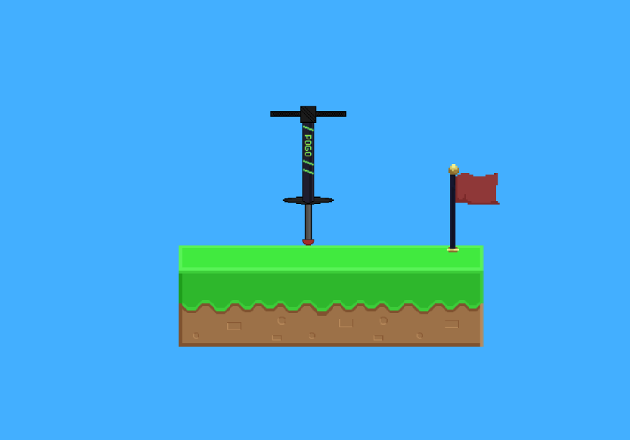
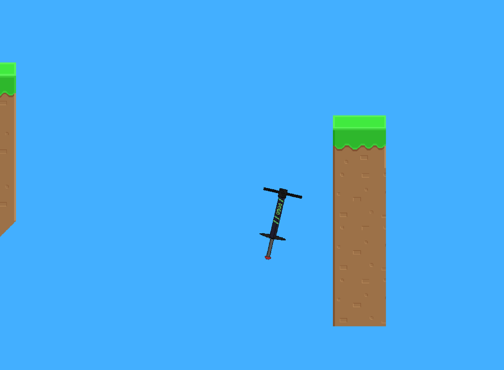

# Pogostick Project

A physics-driven 2D platformer built in Godot, centered around unique pogo-stick movement and precise control.

## Gameplay
The game is a single, highly difficult level.
Climb to the waving red flag to complete the game!

  
  

## Controls
- **Rotate Left/Right**: Adjust the pogo-stick orientation mid-air
- **Pause/Menu**: Esc key
- **Jumping**: Driven by physics and orientation rather than a jump button, unless autojump is disabled in the menu

## Technical Highlights
- Built with **Godot 4**
- Custom physics-based movement: pogostick compression, rotation, bouncing, and gravity
- Controls are rotation only, unless the auto jump mode is disabled (makes the game easier)
- Scene-based architecture with tilemap

## Design Focus
This project was an exercise in:
- Designing and tuning physics-driven mechanics for responsiveness
- Structuring gameplay logic using Godot’s node and signal system
- Iterating on control feel through custom physics

The emphasis was on custom physics and challenging yet fun gameplay feel rather than content volume.

## How to Run Locally in Browser
An HTML5 build is included in the 'web/' directory.

1. Download the 'web' folder
2. Run a local web server from the web folder's location '''python3 -m http.server'''
3. Open http://localhost:8000/Pogo%20Stick.html in your browser
4. Play!
